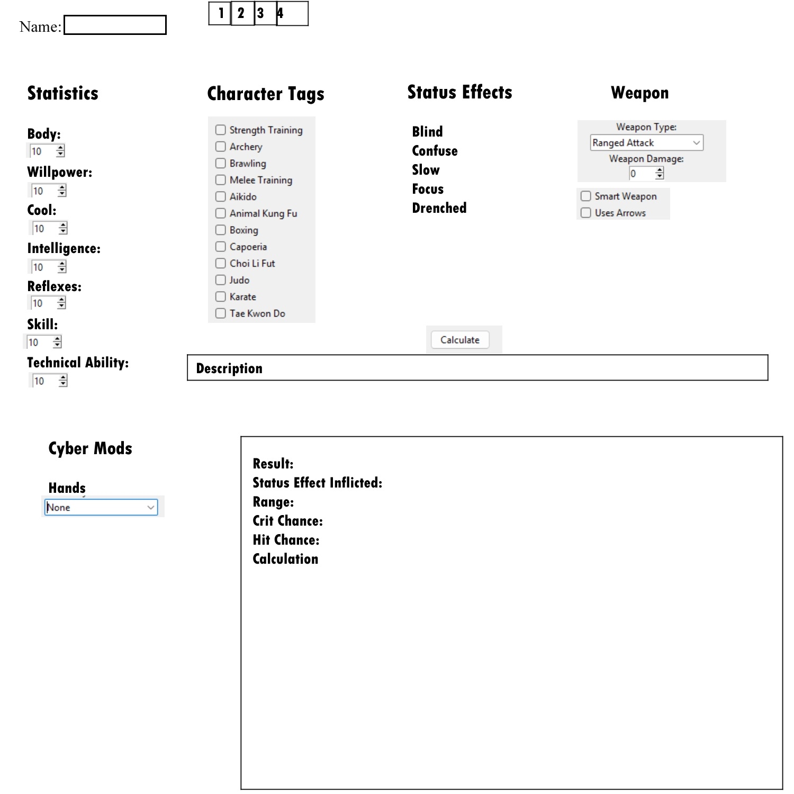

# CyberpunkRPCalc
## Overview
The goal of this project is to facilitate a cyberpunk roleplay campaign. I've yet to meet with the project lead but going off of this [design doc](https://docs.google.com/document/d/13LgayXCpeodINIgvcOWp8RvYPPFfp2X_yK2ZNuREcr0/edit?usp=sharing), we plan on implementing more than just a calculator. 
## UI First draft

## Setup
1. **Clone this repository:**
   ``` bash
   git clone https://github.com/Francisc0Leyva/CyberpunkRPCalc.git
   cd CyberpunkRPCalc
   ```
2. ``` bash
   python main.py
   ```
