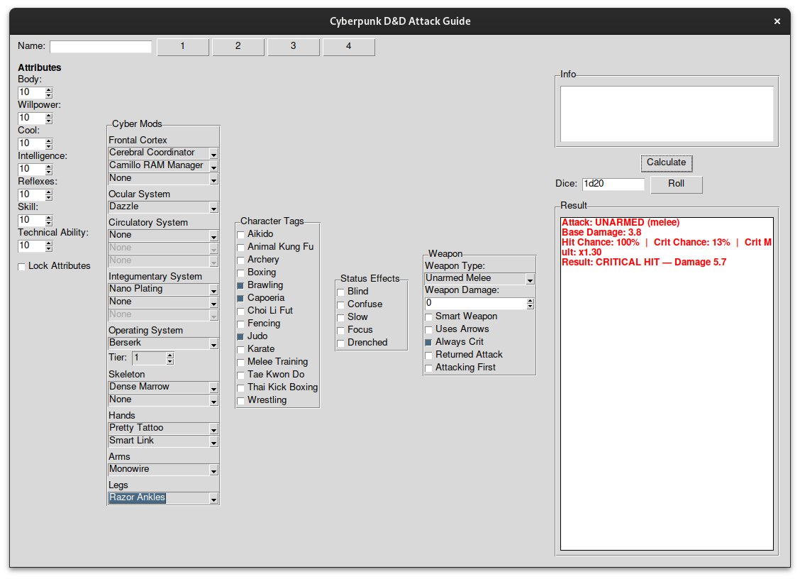

# CyberpunkRPCalc
## Overview
The goal of this project is to facilitate a cyberpunk roleplay campaign. I've yet to meet with the project lead but going off of this [design doc](https://docs.google.com/document/d/13LgayXCpeodINIgvcOWp8RvYPPFfp2X_yK2ZNuREcr0/edit?usp=sharing), we plan on implementing more than just a calculator. 
## UI (in development)

## Setup
1. **Clone this repository:**
   ``` bash
   git clone https://github.com/Francisc0Leyva/CyberpunkRPCalc.git
   cd CyberpunkRPCalc
   ```
2. **Create and run a virtual environment**
   ``` bash
   python -m venv .venv
   source .venv/bin/activate  # Linux / macOS
   # .venv\Scripts\activate   # Windows PowerShell
   ```
3. **Install dependencies**
   ``` bash
   pip install -r requirements.txt
   ```
4. **Run the app**
   ``` bash
   python main.py
   ```
